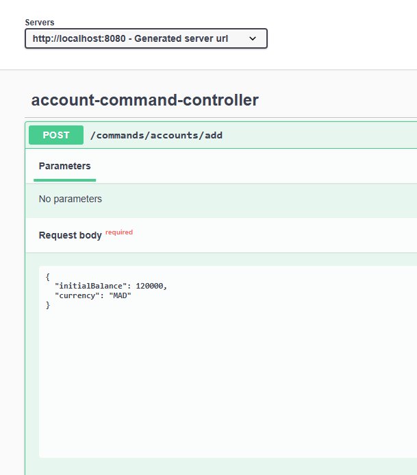
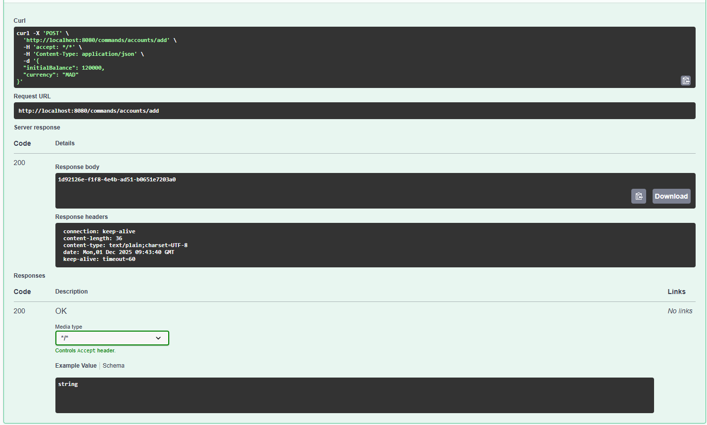
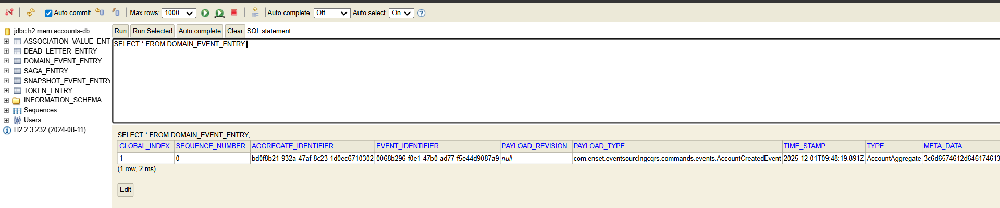
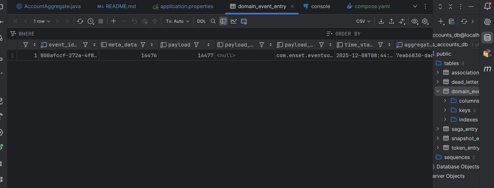
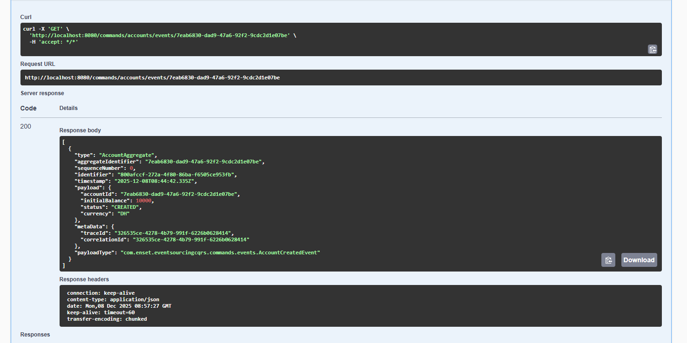
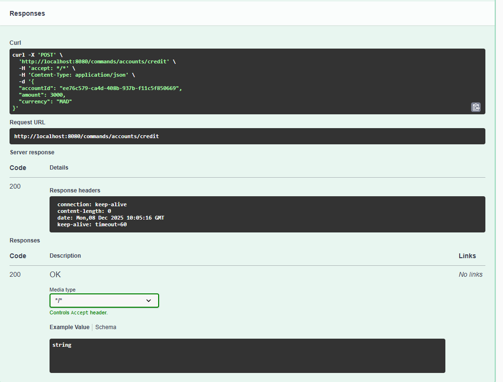
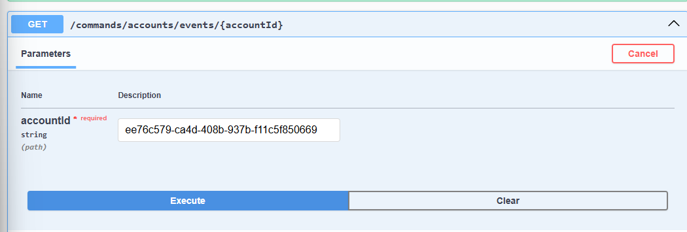
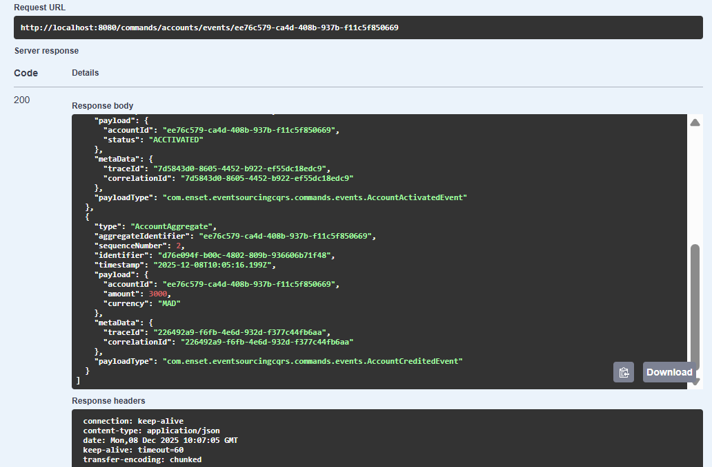
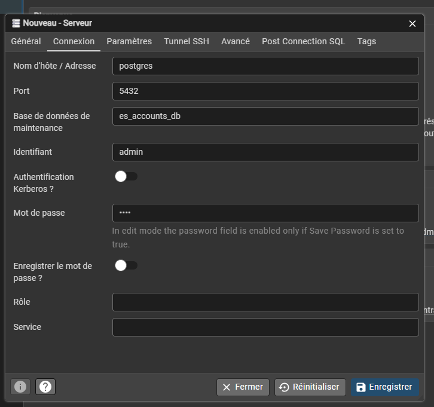
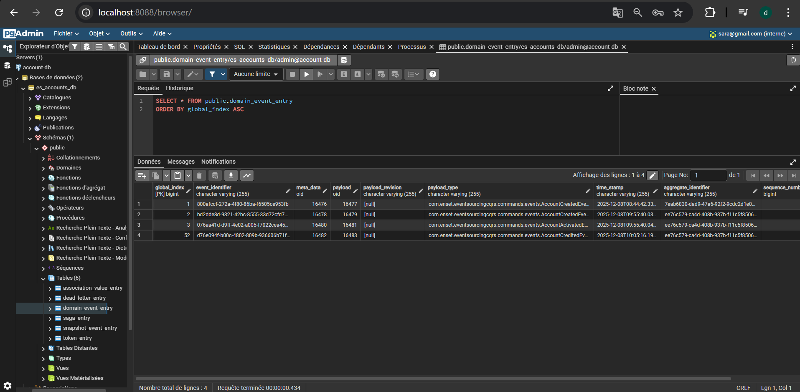

dependance 

 <!-- https://mvnrepository.com/artifact/org.axonframework/axon-spring-boot-starter -->
        <dependency>
            <groupId>org.axonframework</groupId>
            <artifactId>axon-spring-boot-starter</artifactId>
            <version>4.10.3</version>
            <!--<exclusions>
                <exclusion>
                    <groupId>org.axonframework</groupId>
                    <artifactId>axon-server-connector</artifactId>
                </exclusion>
            </exclusions>-->
        </dependency>
        <dependency>
            <groupId>org.springdoc</groupId>
            <artifactId>springdoc-openapi-starter-webmvc-ui</artifactId>
            <version>2.8.4</version>
        </dependency>

##test 

db H2

postgersql 

/commands/accounts/events/{accountId}

TESTE 2:
@CommandHandler
public AccountAggregate(AddAccountCommand command) {
log.info("---------------AddAccountCommand Received -----------------");
if(command.getInitialBalance()<=0) throw new IllegalArgumentException("Initial balance must be greater than zero");
AggregateLifecycle.apply(new AccountCreatedEvent(
command.getId(),
command.getInitialBalance(),
AccountStatus.CREATED,
command.getCurrency()
));
AggregateLifecycle.apply(new AccountActivatedEvent(
command.getId(),
AccountStatus.ACCTIVATED
));
}

 IL YA DEUX EVNEMENT 

[
{
"type": "AccountAggregate",
"aggregateIdentifier": "ee76c579-ca4d-408b-937b-f11c5f850669",
"sequenceNumber": 0,
"identifier": "bd2dde8d-9321-42bc-8555-33d72cfd7adb",
"timestamp": "2025-12-08T09:55:40.038Z",
"payload": {
"accountId": "ee76c579-ca4d-408b-937b-f11c5f850669",
"initialBalance": 2300000,
"status": "CREATED",
"currency": "MAD"
},
"metaData": {
"traceId": "7d5843d0-8605-4452-b922-ef55dc18edc9",
"correlationId": "7d5843d0-8605-4452-b922-ef55dc18edc9"
},
"payloadType": "com.enset.eventsourcingcqrs.commands.events.AccountCreatedEvent"
},
{
"type": "AccountAggregate",
"aggregateIdentifier": "ee76c579-ca4d-408b-937b-f11c5f850669",
"sequenceNumber": 1,
"identifier": "076aa41d-d9ff-4e02-a005-f7022cea4590",
"timestamp": "2025-12-08T09:55:40.043Z",
"payload": {
"accountId": "ee76c579-ca4d-408b-937b-f11c5f850669",
"status": "ACCTIVATED"
},
"metaData": {
"traceId": "7d5843d0-8605-4452-b922-ef55dc18edc9",
"correlationId": "7d5843d0-8605-4452-b922-ef55dc18edc9"
},
"payloadType": "com.enset.eventsourcingcqrs.commands.events.AccountActivatedEvent"
}
]

faire un credit 

reponse

voir les evenement 

reponse 

l'inerafce postqsgl admin 

la table public.domain_event_entry
