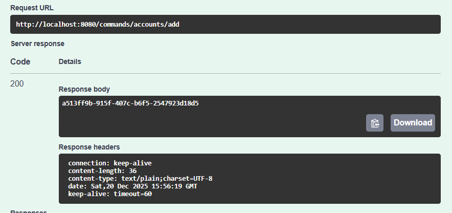
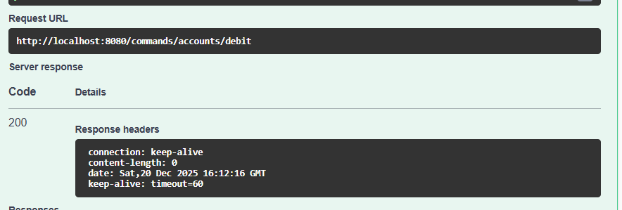
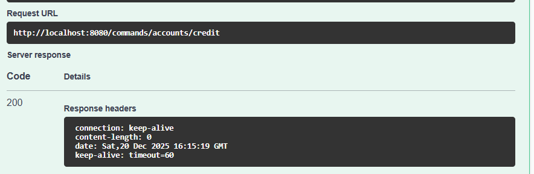
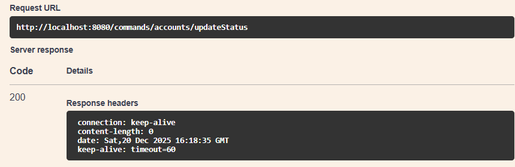
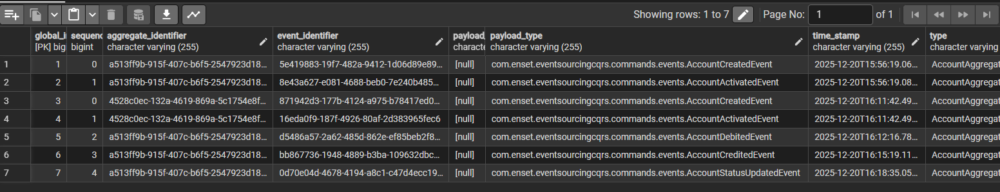
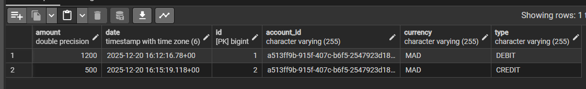

# EventSourcingCors

Un projet d'exemple démontrant l'usage de CQRS + Event Sourcing avec Spring Boot et Axon Framework.

## Vue d'ensemble

Principales caractéristiques :

- Architecture Command / Query (Axon)
- Event Sourcing (persistance des événements)
- API REST pour les commandes (création, crédit, débit, mise à jour)
- Documentation OpenAPI via springdoc

## Arborescence (rapide)

- `src/main/java/com/enset/eventsourcingcqrs/commands` : agrégats, commandes, événements, contrôleurs
- `src/main/java/com/enset/eventsourcingcqrs/query` : entités de lecture, handlers d'événements, repos

## Prérequis

- Java 21
- Maven 3.6+
- Docker pour exécuter PostgreSQL localement

## Dépendances clés

Extraits importants du `pom.xml` :

```xml
<!-- Axon Framework (CQRS + Event Sourcing) -->
<dependency>
    <groupId>org.axonframework</groupId>
    <artifactId>axon-spring-boot-starter</artifactId>
    <version>4.10.3</version>
    <exclusions>
        <exclusion>
            <groupId>org.axonframework</groupId>
            <artifactId>axon-server-connector</artifactId>
        </exclusion>
    </exclusions>
</dependency>

<!-- OpenAPI / Swagger UI -->
<dependency>
    <groupId>org.springdoc</groupId>
    <artifactId>springdoc-openapi-starter-webmvc-ui</artifactId>
    <version>2.8.4</version>
</dependency>

<!-- H2 (runtime/test) et PostgreSQL (runtime) -->
<dependency>
    <groupId>com.h2database</groupId>
    <artifactId>h2</artifactId>
    <scope>runtime</scope>
</dependency>
<dependency>
    <groupId>org.postgresql</groupId>
    <artifactId>postgresql</artifactId>
    <scope>runtime</scope>
</dependency>
```


## Configuration

Le fichier principal est `src/main/resources/application.properties`.

- Par défaut la configuration pointe vers PostgreSQL via `DB_URL` (variable d'environnement) :

```properties
spring.datasource.url=${DB_URL:jdbc:postgresql://localhost:5432/es_accounts_db}
spring.datasource.username=admin
spring.datasource.password=1234
spring.jpa.hibernate.ddl-auto=create
axon.serializer.events=jackson
```

- Pour tests rapides en mémoire : décommentez la configuration H2 et désactivez Postgres (voir `application.properties`).

## Démarrage

```bash
mvn clean package
mvn spring-boot:run
```

ou

```bash
java -jar target/EventSourcingCqrs-0.0.1-SNAPSHOT.jar
```

## Endpoints importants

- POST `/commands/accounts` — créer un compte (DTO : `AddNewAccountRequestDTO`)
- POST `/commands/accounts/credit` — créditer un compte (DTO : `CreditAccountRequestDTO`)
- POST `/commands/accounts/debit` — débiter un compte
- POST `/commands/accounts/status` — mettre à jour le statut
- GET  `/commands/accounts/events/{accountId}` — lister les événements d'un agrégat


Exemple JSON création compte :

```json
{
    "initialBalance": 13000,
    "currency": "MAD"
}
```



## Détails des endpoints

Toutes les routes exposées par le contrôleur de commandes sont préfixées par `/commands/accounts`.

POST /commands/accounts/add

POST /commands/accounts/debit
```json
{
  "accountId": "a513ff9b-915f-407c-b6f5-2547923d18d5",
  "amount": 1200,
  "currency": "MAD"
}
```

POST /commands/accounts/credit
```json
{
  "accountId": "a513ff9b-915f-407c-b6f5-2547923d18d5",
  "amount": 500,
  "currency": "MAD"
}
```



PUT /commands/accounts/updateStatus
- Description : met à jour le statut d'un compte (ex. `ACCTIVATED` -> `SUSPENDED`).

```json
{
  "accountId": "a513ff9b-915f-407c-b6f5-2547923d18d5",
  "status": "SUSPENDED"
}
```


GET /commands/accounts/events/{accountId}
- Description : retourne le flux d'événements stockés pour l'agrégat identifié par `accountId`.
- Réponse : flux d'objets événements (stream renvoyé par l'`EventStore`).
- Exemple :

```bash
curl http://localhost:8080/commands/accounts/events/a513ff9b-915f-407c-b6f5-2547923d18d5
```
Lors de la création, l'agrégat applique deux événements : `AccountCreatedEvent` puis `AccountActivatedEvent`.

Exemple d'objet d'événements enregistré :

```json
 [
  {
    "type": "AccountAggregate",
    "aggregateIdentifier": "a513ff9b-915f-407c-b6f5-2547923d18d5",
    "sequenceNumber": 0,
    "timestamp": "2025-12-20T15:56:19.069Z",
    "identifier": "5e419883-19f7-482a-9412-1d06d89e89f6",
    "payload": {
      "accountId": "a513ff9b-915f-407c-b6f5-2547923d18d5",
      "initialBalance": 13000,
      "status": "CREATED",
      "currency": "MAD"
    },
    "payloadType": "com.enset.eventsourcingcqrs.commands.events.AccountCreatedEvent",
    "metaData": {
      "traceId": "2e005fb6-10b2-46ee-bbde-fe809a0b42bc",
      "correlationId": "2e005fb6-10b2-46ee-bbde-fe809a0b42bc"
    }
  },
  {
    "type": "AccountAggregate",
    "aggregateIdentifier": "a513ff9b-915f-407c-b6f5-2547923d18d5",
    "sequenceNumber": 1,
    "timestamp": "2025-12-20T15:56:19.088Z",
    "identifier": "8e43a627-e081-4688-beb0-7e240b485c5b",
    "payload": {
      "accountId": "a513ff9b-915f-407c-b6f5-2547923d18d5",
      "status": "ACCTIVATED"
    },
    "payloadType": "com.enset.eventsourcingcqrs.commands.events.AccountActivatedEvent",
    "metaData": {
      "traceId": "2e005fb6-10b2-46ee-bbde-fe809a0b42bc",
      "correlationId": "2e005fb6-10b2-46ee-bbde-fe809a0b42bc"
    }
  },
  {
    "type": "AccountAggregate",
    "aggregateIdentifier": "a513ff9b-915f-407c-b6f5-2547923d18d5",
    "sequenceNumber": 2,
    "timestamp": "2025-12-20T16:12:16.780Z",
    "identifier": "d5486a57-2a62-485d-862e-ef85beb2f8c3",
    "payload": {
      "accountId": "a513ff9b-915f-407c-b6f5-2547923d18d5",
      "amount": 1200,
      "currency": "MAD"
    },
    "payloadType": "com.enset.eventsourcingcqrs.commands.events.AccountDebitedEvent",
    "metaData": {
      "traceId": "bf7821a0-d264-4b3a-809b-79edcd980b40",
      "correlationId": "bf7821a0-d264-4b3a-809b-79edcd980b40"
    }
  },
  {
    "type": "AccountAggregate",
    "aggregateIdentifier": "a513ff9b-915f-407c-b6f5-2547923d18d5",
    "sequenceNumber": 3,
    "timestamp": "2025-12-20T16:15:19.118Z",
    "identifier": "bb867736-1948-4889-b3ba-109632dbcc12",
    "payload": {
      "accountId": "a513ff9b-915f-407c-b6f5-2547923d18d5",
      "amount": 500,
      "currency": "MAD"
    },
    "payloadType": "com.enset.eventsourcingcqrs.commands.events.AccountCreditedEvent",
    "metaData": {
      "traceId": "63de7373-5be0-493e-85d4-c5a08cbdfcae",
      "correlationId": "63de7373-5be0-493e-85d4-c5a08cbdfcae"
    }
  },
  {
    "type": "AccountAggregate",
    "aggregateIdentifier": "a513ff9b-915f-407c-b6f5-2547923d18d5",
    "sequenceNumber": 4,
    "timestamp": "2025-12-20T16:18:35.054Z",
    "identifier": "0d70e04d-4678-4194-a8c1-c47d4ecc19c2",
    "payload": {
      "accountId": "a513ff9b-915f-407c-b6f5-2547923d18d5",
      "status": "SUSPENDED"
    },
    "payloadType": "com.enset.eventsourcingcqrs.commands.events.AccountStatusUpdatedEvent",
    "metaData": {
      "traceId": "bdc8897e-4db7-4837-8012-41d45727cd1e",
      "correlationId": "bdc8897e-4db7-4837-8012-41d45727cd1e"
    }
  }
]
```

## Stockage des événements

- En production avec PostgreSQL, Axon enregistre les événements dans la table `public.domain_event_entry`.



- la table account_operation





